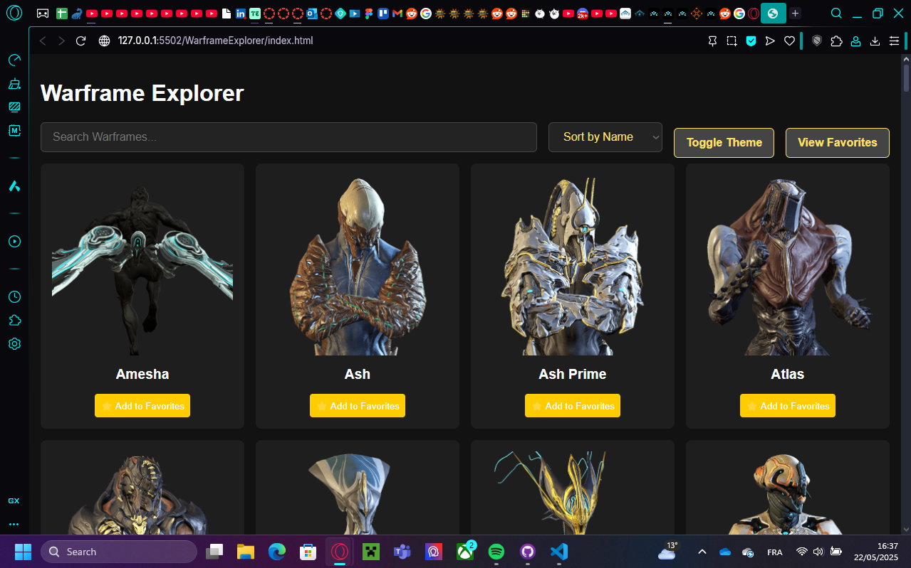
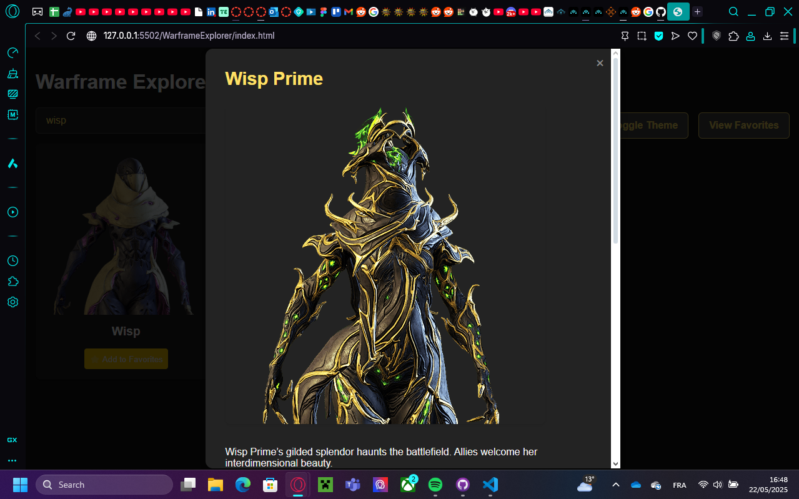

# Warframe Explorer

## Projectbeschrijving
Warframe Explorer is een interactieve single-page webapplicatie waarmee gebruikers Warframes kunnen verkennen, filteren, sorteren en favorieten kunnen opslaan. De applicatie maakt gebruik van de officiële Warframe API.

## Functionaliteiten
- **Dataverzameling & Weergave**: Haalt data op van de Warframe API en toont deze in een visueel aantrekkelijke lijst.
- **Zoekfunctie**: Zoek op naam van Warframes.
- **Filteren & Sorteren**: Sorteer op naam of gezondheid.
- **Personalisatie**: Sla favorieten op en wissel tussen licht/donker thema.
- **Responsive Design**: Geschikt voor verschillende apparaten.

## Gebruikte API
- [Warframe API](https://api.warframestat.us/warframes/)

## Installatiehandleiding
1. Clone de repository.
2. Open `index.html` in een browser.
3. Zorg dat je internetverbinding hebt om de API te bereiken.

## Screenshots

## Gebruikte bronnen
- Warframe API documentatie
- MDN Web Docs
- ChatGPT AI
- Github Copilot
- https://www.youtube.com/watch?v=4Gp-IUngvDE
